# Current Progress Diagram

```mermaid
flowchart LR
    A["RTL Design"] --> B["Local RTL Regression"]
    B --> C["SDK App + Memory Image"]
    C --> D["Full-SoC Regression"]
    D --> E["FPGA Programming Path"]
    E --> F["Board-Side Runtime Evidence"]
    F --> G["CPU Software Debug"]

    B:::done
    D:::done
    E:::partial
    F:::todo
    G:::blocked

    classDef done fill:#d9f7be,stroke:#52c41a,color:#1f1f1f
    classDef partial fill:#fff1b8,stroke:#faad14,color:#1f1f1f
    classDef todo fill:#e6f4ff,stroke:#1677ff,color:#1f1f1f
    classDef blocked fill:#ffd6e7,stroke:#eb2f96,color:#1f1f1f
```

## Status Legend

- Green: closed and verified
- Yellow: prepared, but not the final proof
- Blue: next evidence to collect
- Pink: current blocker

## Current Reading

- RTL regression is closed.
- Full-SoC regression is closed.
- FPGA programming path is prepared.
- Board-side runtime evidence and CPU software debug remain the next-stage focus.
